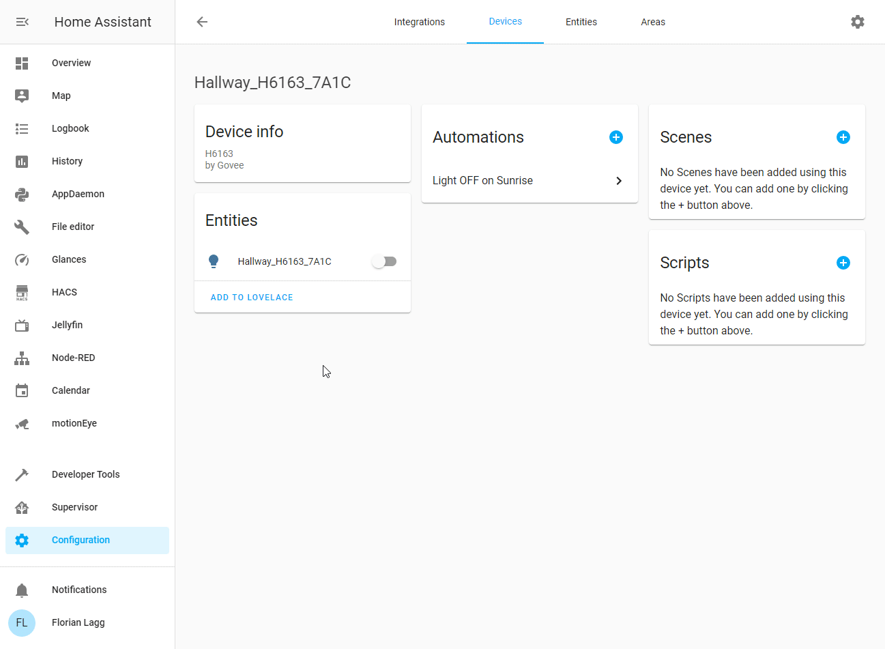

# govee-api-laggat Package

Python implementation of the govee API 1.0 to control the cheap and colorful LED strips.

## Why / Motivation

I want to use this package in an Home Assistant Component to control my new light strips.

Remember: this is NOT the integration, but the library the integration uses.

The custom integration project lives here: [github.com/LaggAt/hacs-govee](https://github.com/LaggAt/hacs-govee)

## Usage in your project

[Look at the /example folder in this repo.](https://github.com/LaggAt/python-govee-api/tree/master/example)

## Govee trademark

Govee and the Govee logo are trademarks or registered trademarks of Shenzhen Intellirock Company Limited, and used by Govee with permission. Neither your use of the Govee Logo grant you any right, title, or interest in, or any license to reproduce or otherwise use, the Govee logo. You shall not at any time, nor shall you assist others to, challenge Govee's right, title, or interest in, or the validity of, the Govee Marks.

## Links

- PyPi project and python package: [pypi.org/project/govee-api-laggat](https://pypi.org/project/govee-api-laggat/)
- Home Assistant custom integration Git: [github.com/LaggAt/hacs-govee](https://github.com/LaggAt/hacs-govee)

## API Key

To get an api key you need to install the 'Govee Home' app on your mobile and browse the user tab - About - Request API key. Usually you get your key within seconds by mail.

## Issues / Improvements

There are two projects, this one is the API implementation for python. 
The second project is the custom integration into Home Assistant which currently lives [github.com/LaggAt/hacs-govee](https://github.com/LaggAt/hacs-govee)

Feel free to fork and start a pull request in your feature/bug branch. 
If you cannot fix or extend it yourself, you may want to add an issue in the correct project, but it may take a bit longer.

## development

* pip install setuptools wheel tox
* Fork and clone the repository
* Make a 'feature/NAME' or 'bug/NAME' branch
* Run tests: tox
* commit and start a pull request
